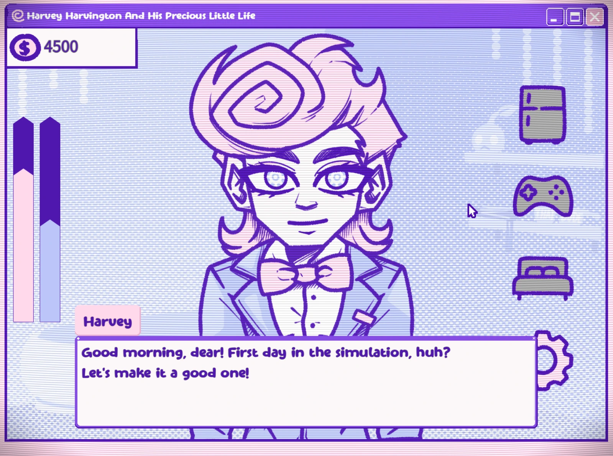

# BloodMoney 2 Browser Game Collection

BloodMoney 2 is a browser-first game collection for players who enjoy dark interactive stories, unsettling simulations, horror visual novels, puzzle games, and unusual web experiences. The project places playable games at the center of each page, then supports them with original introductions, screenshots, videos, practical browser help, and frequently asked questions. Visitors can begin playing without searching through a download directory or installing a separate launcher. The main website is designed to make every game easy to discover, understand, and revisit from desktop or mobile browsers.

## Visit the Website

- **Official website:** [https://bloodmoney2.app/](https://bloodmoney2.app/)
- **Play online:** <a href="https://bloodmoney2.app/" target="_blank" rel="noopener">Open the BloodMoney 2 game collection</a>
- **Game format:** Browser games, interactive fiction, horror, puzzles, simulation, and arcade experiences

The public website provides the complete experience. This repository contains the generated static export used for deployment, while the live site supplies the intended navigation, responsive layout, embedded game frames, fullscreen controls, categorized cards, and long-form game guides.

## A Collection Built Around Choice and Consequence

The BloodMoney 2 collection is interested in games where a simple action can become uncomfortable after its consequences are revealed. Some pages focus on money, pressure, and human cost. Others explore survival, suspicious relationships, hostile environments, or systems that quietly change their rules. This variety allows the site to support short experimental games alongside longer visual novels. Each page preserves the identity of its game while using a consistent structure that helps players find the launch button, related titles, visual references, and useful information without unnecessary friction.

The homepage organizes games into recognizable categories instead of presenting one unstructured wall of links. Horror and story games sit beside puzzle, action, clicker, platformer, music, and sandbox selections. This makes the collection useful for players arriving with a specific mood. Someone looking for a tense narrative can move directly toward psychological horror, while another visitor can choose a faster arcade or strategy experience. Shared cards connect every game page, so discovering one title naturally leads to the rest of the catalog.

## Play Directly in the Browser

Every supported game page includes a prominent play area. The game iframe loads only when needed, helping the initial page remain responsive while still giving players a clear route into the experience. Fullscreen controls are available where supported, and direct links or browser guidance help when privacy settings interfere with an embedded build. The site also explains common issues such as black frames, blocked audio, local save storage, mobile orientation, and the effect of script-blocking extensions. These details matter because a technically available game is not useful if visitors cannot understand why it failed to start.

Browser play also makes replay easier. Visual novels and route-driven games often reward returning to an earlier choice, testing a different attitude, or comparing several endings. A web page can become a stable launch point for those experiments. Players can return to the same canonical address, review screenshots or notes, and reopen the game without locating an old archive. The surrounding guide remains available before and after play, helping new visitors avoid spoilers while giving returning players enough context to plan another run.

## Featured Story Worlds

The catalog includes intimate horror experiences where danger comes from attention, relationships, domestic spaces, and uncertain trust. Home Is Where He Is turns the idea of safety into a question about control and belonging. Other games use security systems, changing pursuit rules, surreal conversations, or character routes to create pressure. Although these titles differ in tone, the site presents each one through its own artwork and project-specific description instead of reducing every experience to the same generic horror summary.

Original long-form writing is an important part of the project. Game pages are designed to answer real search and player questions: what the game is, how it plays, whether it works on mobile, what themes it contains, why routes are worth replaying, and what to try when the browser frame does not load. Screenshots are placed near relevant sections, and descriptive alternative text supports accessibility and image discovery without stuffing unrelated keywords.

## Casino Pressure and Public Performance

Jackpot Crash Course represents another side of the collection. Its casino death-game premise turns pardon, reputation, rivalry, and luck into public entertainment. The page pairs the playable browser build with videos, character-focused analysis, route strategy, and mature-content guidance. It demonstrates how the site can add a new game while preserving the BloodMoney 2 visual format, homepage categories, shared game cards, and sitemap structure. Related images and videos remain local or privacy-conscious wherever possible, keeping the page stable for static deployment.

## Static Deployment Repository

This repository is the output of the Next.js static export process. HTML, CSS, JavaScript, images, metadata, robots rules, and sitemap files are generated into `out/` for deployment. The command `npm run build-preserve-git` protects the Git metadata stored inside `out/.git`, rebuilds the export in a temporary workspace, restores the deployment repository, and regenerates this README. If Git metadata is missing, the workflow initializes the `main` branch and configures the correct GitHub remote.

The generated files should not be treated as the primary source code for editing page content. Source changes belong in the main application, followed by a fresh static build. Keeping that boundary clear prevents manual changes in `out/` from disappearing during the next export. For the latest playable games, screenshots, guides, and updates, visit [bloodmoney2.app](https://bloodmoney2.app/) and use the live navigation rather than browsing deployment files individually.
